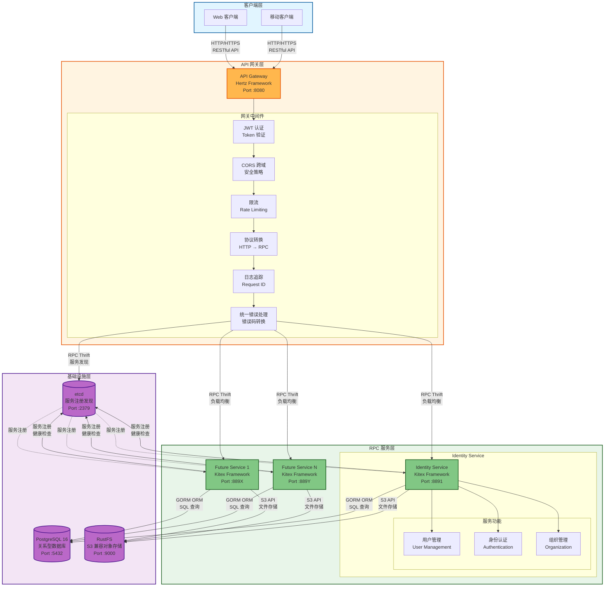
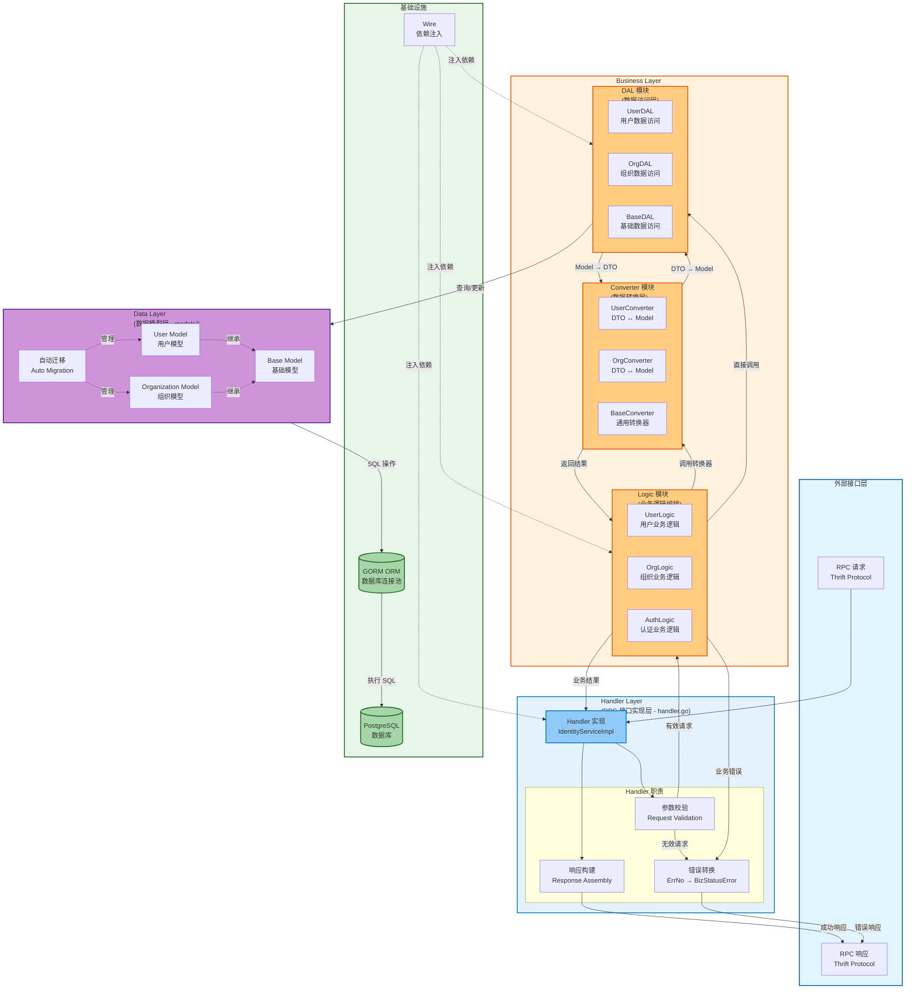

# CloudWeGo Scaffold

> 基于 CloudWeGo 技术栈的 Go 微服务脚手架项目

[](https://go.dev/)
[](https://github.com/cloudwego/kitex)
[](https://github.com/cloudwego/hertz)
[](LICENSE)

## 项目简介

CloudWeGo Scaffold 是一个生产级的微服务脚手架项目，采用 CloudWeGo 全家桶技术栈，遵循 **IDL-First** 开发模式和 **DDD（领域驱动设计）** 架构原则。项目使用 Go Workspace 管理多个服务模块，提供开箱即用的微服务开发基础设施。

### 核心特性

- 🚀 **高性能框架**：基于 Kitex (RPC) 和 Hertz (HTTP) 的高性能微服务框架
- 🏗️ **IDL-First**：通过 Thrift IDL 定义接口，自动生成代码，确保前后端契约一致
- 🔧 **依赖注入**：使用 Google Wire 进行编译时依赖注入，类型安全且高效
- 🔐 **安全认证**：集成 JWT 认证、权限控制、CORS 等安全中间件
- 📦 **开箱即用**：Docker Compose 一键启动所有服务和基础设施
- 📊 **可观测性**：完整的日志追踪、请求链路追踪（request_id/trace_id）
- 🗄️ **数据库管理**：GORM ORM、自动迁移、连接池优化
- 📁 **对象存储**：集成 S3 兼容存储（RustFS），支持文件上传和管理
- 🧪 **测试友好**：分层架构便于单元测试和集成测试

## 技术栈

### 核心框架

- **Go**: 1.24+
- **RPC 框架**: [Kitex](https://github.com/cloudwego/kitex) - CloudWeGo 高性能 RPC 框架
- **HTTP 框架**: [Hertz](https://github.com/cloudwego/hertz) - CloudWeGo 高性能 HTTP 框架
- **接口协议**: Thrift

### 基础设施

- **数据库**: PostgreSQL 16 + [GORM](https://gorm.io/)
- **服务注册发现**: etcd
- **对象存储**: RustFS (S3 兼容)
- **依赖注入**: [Google Wire](https://github.com/google/wire)
- **日志**: slog (Go 标准库)
- **配置管理**: [Viper](https://github.com/spf13/viper)

### 开发工具

- **代码检查**: golangci-lint
- **容器化**: Docker + Docker Compose
- **API 文档**: Swagger (自动生成)

## 项目架构

### 微服务架构



### RPC 服务分层架构



### 当前服务

| 服务名称     | 框架    | 端口  | 描述                               |
| ------------ | ------- | ----- | ---------------------------------- |
| **gateway**  | Hertz   | 8080  | HTTP 网关，提供统一 API 入口       |
| **identity_srv** | Kitex | 8891  | 身份认证服务，管理用户、认证、组织 |

## 快速开始

### 前置要求

- **Go**: 1.24+ ([下载](https://go.dev/dl/))
- **Docker**: 20.10+ ([安装](https://docs.docker.com/get-docker/))
- **Docker Compose**: 2.0+ ([安装](https://docs.docker.com/compose/install/))

### 方式一：Docker 快速启动（推荐）

这是最简单的启动方式，适合快速体验和开发。

```bash
# 1. 克隆项目
git clone <repository-url>
cd cloudwego-scaffold

# 2. 进入 docker 目录
cd docker

# 3. 复制环境配置（可选，默认配置已优化）
cp .env.dev.example .env

# 4. 启动所有服务（基础设施 + 应用）
./deploy.sh dev up

# 5. 查看服务状态
./deploy.sh dev ps

# 6. 查看日志
./deploy.sh dev logs              # 所有日志
./deploy.sh follow identity_srv   # 实时跟踪特定服务
```

服务启动后访问：

- **HTTP API**: http://localhost:8080
- **Swagger 文档**: http://localhost:8080/swagger/index.html
- **健康检查**: http://localhost:8080/health

### 方式二：本地开发模式

适合需要调试单个服务或修改代码的场景。

```bash
# 1. 安装开发工具
go install github.com/cloudwego/kitex/tool/cmd/kitex@latest
go install github.com/cloudwego/thriftgo@latest
go install github.com/cloudwego/hertz/cmd/hz@latest
go install github.com/google/wire/cmd/wire@latest

# 2. 启动基础设施（数据库、etcd、对象存储）
cd docker
./deploy.sh dev up-base

# 3. 配置 RPC 服务环境变量
cd ../rpc/identity_srv
cp .env.example .env
vim .env  # 修改数据库连接等配置

# 4. 启动 identity_srv RPC 服务
sh build.sh && sh output/bootstrap.sh

# 5. 在新终端配置并启动 gateway
cd ../../gateway
cp .env.example .env
vim .env

# 6. 启动 gateway HTTP 服务
sh build.sh && sh output/bootstrap.sh
```

### 验证安装

```bash
# 健康检查
curl http://localhost:8080/health

# 预期输出
{"status":"ok"}

# 测试登录接口（示例）
curl -X POST http://localhost:8080/api/v1/identity/auth/login \
  -H "Content-Type: application/json" \
  -d '{
    "username": "admin",
    "password": "password123"
  }'
```

## 项目结构

```
cloudwego-scaffold/
├── docker/                      # Docker 部署相关
│   ├── .env.dev.example         # Docker 环境配置模板
│   ├── deploy.sh                # 部署脚本
│   ├── docker-compose.base.yml  # 基础设施服务
│   └── docker-compose.apps.yml  # 应用服务
│
├── gateway/                     # HTTP 网关服务
│   ├── biz/                     # HTTP 业务层（IDL 生成）
│   │   ├── handler/             # HTTP Handler 实现
│   │   ├── model/               # HTTP DTO
│   │   └── router/              # 路由注册
│   ├── internal/                # 内部实现
│   │   ├── application/         # 应用层
│   │   │   ├── assembler/       # 数据组装器
│   │   │   └── middleware/      # 中间件（JWT、CORS、追踪）
│   │   ├── domain/              # 领域层
│   │   │   └── service/         # 领域服务
│   │   ├── infrastructure/      # 基础设施层
│   │   │   ├── client/          # RPC 客户端封装
│   │   │   ├── config/          # 配置管理
│   │   │   └── errors/          # 统一错误处理
│   │   └── wire/                # Wire 依赖注入
│   ├── docs/                    # Swagger 文档（自动生成）
│   ├── .env.example             # 网关环境配置模板
│   ├── build.sh                 # 构建脚本
│   └── main.go                  # 入口文件
│
├── rpc/                         # RPC 服务目录
│   └── identity_srv/            # 身份认证 RPC 服务
│       ├── handler.go           # RPC 接口实现（适配层）
│       ├── biz/                 # 核心业务逻辑层
│       │   ├── converter/       # DTO ↔ Model 转换
│       │   │   ├── base/        # 基础转换器
│       │   │   ├── user_profile/
│       │   │   └── organization/
│       │   ├── dal/             # 数据访问层
│       │   │   ├── base/        # 基础数据访问组件
│       │   │   ├── user_profile/
│       │   │   └── organization/
│       │   └── logic/           # 业务逻辑实现
│       │       ├── user_profile/
│       │       └── organization/
│       ├── models/              # GORM 数据模型
│       ├── kitex_gen/           # IDL 生成代码（勿手动修改）
│       ├── config/              # 服务配置
│       ├── wire/                # Wire 依赖注入配置
│       ├── internal/            # 内部实现
│       │   └── middleware/      # RPC 中间件（追踪）
│       ├── script/              # 脚本工具
│       │   └── gen_kitex_code.sh  # Kitex 代码生成脚本
│       ├── .env.example         # 服务环境配置模板
│       └── build.sh             # 构建脚本
│
├── idl/                         # Thrift IDL 定义
│   ├── api/                     # HTTP API IDL
│   │   └── identity/
│   ├── rpc/                     # RPC 服务 IDL
│   │   └── identity_srv/
│   └── common/                  # 公共 IDL 定义
│
├── scripts/                     # 项目级脚本
│   └── git-hooks/               # Git 钩子脚本
│       └── pre-commit           # 提交前检查
│
├── CLAUDE.md                    # Claude Code 项目指南
├── .golangci.yml                # golangci-lint 配置
├── go.work                      # Go Workspace 配置
└── README.md                    # 项目说明文档（本文件）
```

## 开发指南

### IDL-First 开发流程

本项目严格遵循 **IDL-First** 开发模式：

```
1. 定义接口
   ↓
   修改 idl/ 目录下的 Thrift 文件

2. 生成代码
   ↓
   使用 Kitex/Hertz 工具自动生成服务代码

3. 实现业务逻辑
   ↓
   在 biz/ 目录下实现具体业务逻辑

4. 测试验证
   ↓
   编写单元测试和集成测试
```

#### 示例：添加新的 RPC 接口

```bash
# 1. 修改 IDL 文件
vim idl/rpc/identity_srv/identity_service.thrift

# 添加新的接口定义
service IdentityService {
    // 新接口
    CreateRoleResp CreateRole(1: CreateRoleReq req)
}

# 2. 生成 Kitex 代码
cd rpc/identity_srv
./script/gen_kitex_code.sh

# 3. 实现业务逻辑
# 在 biz/logic/role/ 目录创建业务逻辑
# 在 biz/dal/role/ 目录创建数据访问层
# 在 biz/converter/role/ 目录创建转换器

# 4. 在 handler.go 中实现接口
vim handler.go

# 5. 更新 Wire 依赖注入（如果需要）
cd wire
wire

# 6. 编写测试
go test ./biz/logic/role/... -v
```

### 分层职责

#### Handler 层（handler.go）

```go
// 职责：参数校验、调用转换器、委托业务逻辑层
func (s *IdentityServiceImpl) CreateUser(ctx context.Context, req *identity_srv.CreateUserReq) (*identity_srv.CreateUserResp, error) {
    // 1. 参数校验（必要时）
    if req.Username == "" {
        return nil, errno.ToKitexError(errno.ErrInvalidParam.WithMessage("用户名不能为空"))
    }

    // 2. 调用转换器：DTO → Model
    userModel := converter.ToUserModel(req)

    // 3. 委托业务逻辑层
    createdUser, err := s.userLogic.CreateUser(ctx, userModel)
    if err != nil {
        return nil, errno.ToKitexError(err)
    }

    // 4. 调用转换器：Model → DTO
    return &identity_srv.CreateUserResp{
        User: converter.ToUserDTO(createdUser),
    }, nil
}
```

#### Logic 层（biz/logic/）

```go
// 职责：核心业务逻辑、编排 DAL 层操作
type UserLogic struct {
    userDAL *dal.UserDAL
    orgDAL  *dal.OrganizationDAL
}

func (l *UserLogic) CreateUser(ctx context.Context, user *models.User) (*models.User, error) {
    // 1. 业务规则校验
    if err := l.validateUser(user); err != nil {
        return nil, err
    }

    // 2. 密码加密
    hashedPassword, err := bcrypt.GenerateFromPassword([]byte(user.Password), bcrypt.DefaultCost)
    if err != nil {
        return nil, errno.ErrInternalServer
    }
    user.PasswordHash = string(hashedPassword)

    // 3. 调用 DAL 层持久化
    if err := l.userDAL.Create(ctx, user); err != nil {
        return nil, err
    }

    return user, nil
}
```

#### DAL 层（biz/dal/）

```go
// 职责：数据持久化、封装 GORM 操作、错误转换
type UserDAL struct {
    db *gorm.DB
}

func (d *UserDAL) Create(ctx context.Context, user *models.User) error {
    if err := d.db.WithContext(ctx).Create(user).Error; err != nil {
        // 转换 GORM 错误为业务错误
        if errors.Is(err, gorm.ErrDuplicatedKey) {
            return errno.ErrUserAlreadyExists
        }
        return errno.ErrDatabaseOperation.WithCause(err)
    }
    return nil
}
```

#### Converter 层（biz/converter/）

```go
// 职责：DTO 与 Model 之间的纯函数转换
func ToUserModel(req *identity_srv.CreateUserReq) *models.User {
    return &models.User{
        Username:    req.Username,
        Email:       req.Email,
        PhoneNumber: req.PhoneNumber,
        Password:    req.Password,
    }
}

func ToUserDTO(user *models.User) *identity_srv.User {
    return &identity_srv.User{
        Id:          user.ID,
        Username:    user.Username,
        Email:       user.Email,
        PhoneNumber: user.PhoneNumber,
        CreatedAt:   user.CreatedAt.Unix(),
    }
}
```

### Wire 依赖注入

项目使用 Google Wire 进行编译时依赖注入。

#### 添加新的 Provider

```go
// wire/provider.go
func ProvideUserLogic(userDAL *dal.UserDAL) *logic.UserLogic {
    return logic.NewUserLogic(userDAL)
}

// wire/wire.go
var LogicSet = wire.NewSet(
    ProvideUserLogic,
    // 其他 Logic Providers...
)
```

#### 重新生成 Wire 代码

```bash
cd rpc/identity_srv/wire  # 或 gateway/internal/wire
wire
```

### 配置管理

项目采用 **环境变量驱动配置** 模式，不使用 YAML 文件。

#### 配置优先级

1. **系统环境变量**（最高优先级）
2. **`.env` 文件**（环境变量未设置时加载）
3. **`config/defaults.go` 中的默认值**（最低优先级）

#### 添加新配置项

```go
// 1. 在 config/types.go 中定义结构
type Config struct {
    // ...
    NewFeature NewFeatureConfig `mapstructure:"new_feature"`
}

type NewFeatureConfig struct {
    Enabled bool   `mapstructure:"enabled"`
    Timeout int    `mapstructure:"timeout"`
}

// 2. 在 config/defaults.go 中设置默认值
func setDefaults(v *viper.Viper) {
    // ...
    v.SetDefault("new_feature.enabled", false)
    v.SetDefault("new_feature.timeout", 30)
}

// 3. 在 config/env.go 中添加环境变量映射
func loadEnvVariables(v *viper.Viper) {
    // ...
    mapToViper(v, "NEW_FEATURE_ENABLED", "new_feature.enabled", nil)
    mapToViper(v, "NEW_FEATURE_TIMEOUT", "new_feature.timeout", nil)
}

// 4. 在 .env.example 中添加说明
# 新功能配置
NEW_FEATURE_ENABLED=false
NEW_FEATURE_TIMEOUT=30
```

### 错误处理规范

项目采用 6 位数字业务错误码，示例：

```go
// pkg/errno/code.go
const (
    // 用户相关错误 (100xxx)
    CodeUserNotFound      = 100001
    CodeUserAlreadyExists = 100002
    CodeInvalidPassword   = 100003
)

var (
    ErrUserNotFound      = New(CodeUserNotFound, "用户不存在")
    ErrUserAlreadyExists = New(CodeUserAlreadyExists, "用户已存在")
    ErrInvalidPassword   = New(CodeInvalidPassword, "密码错误")
)
```

#### 错误处理流程

```go
// DAL 层：GORM 错误 → ErrNo
func (d *UserDAL) GetByID(ctx context.Context, id uint64) (*models.User, error) {
    var user models.User
    err := d.db.WithContext(ctx).First(&user, id).Error
    if err != nil {
        if errors.Is(err, gorm.ErrRecordNotFound) {
            return nil, errno.ErrUserNotFound  // 转换为业务错误
        }
        return nil, errno.ErrDatabaseOperation.WithCause(err)
    }
    return &user, nil
}

// Handler 层：ErrNo → BizStatusError
func (s *IdentityServiceImpl) GetUser(ctx context.Context, req *identity_srv.GetUserReq) (*identity_srv.GetUserResp, error) {
    user, err := s.userLogic.GetUser(ctx, req.Id)
    if err != nil {
        return nil, errno.ToKitexError(err)  // 转换为 Kitex 错误
    }
    return &identity_srv.GetUserResp{User: converter.ToUserDTO(user)}, nil
}

// 客户端：解析 BizStatusError
resp, err := client.GetUser(ctx, req)
if err != nil {
    if bizErr, ok := kerrors.FromBizStatusError(err); ok {
        fmt.Printf("业务错误码: %d, 消息: %s\n", bizErr.BizStatusCode(), bizErr.BizMessage())
    }
}
```

## 常用命令

### Docker 部署命令

```bash
# 进入 docker 目录
cd docker

# 启动所有服务
./deploy.sh dev up

# 仅启动基础设施（postgres, etcd, rustfs）
./deploy.sh dev up-base

# 仅启动应用服务（identity_srv, gateway）
./deploy.sh dev up-apps

# 停止所有服务
./deploy.sh dev down

# 查看服务状态
./deploy.sh dev ps

# 查看所有日志
./deploy.sh dev logs

# 查看特定服务日志
./deploy.sh dev logs identity_srv

# 实时跟踪日志（推荐）
./deploy.sh follow identity_srv

# 重新构建镜像
./deploy.sh dev rebuild

# 构建特定服务镜像
./deploy.sh dev build identity_srv
./deploy.sh dev build gateway
```

### 代码生成命令

```bash
# 生成 Kitex RPC 代码
cd rpc/identity_srv
./script/gen_kitex_code.sh

# 生成 Hertz HTTP 代码
cd gateway
./script/gen_hertz_code.sh               # 生成所有服务
./script/gen_hertz_code.sh identity      # 仅生成 identity 服务

# 生成 Wire 依赖注入代码
cd rpc/identity_srv/wire && wire
cd gateway/internal/wire && wire
```

### 测试命令

```bash
# 运行所有测试
go test ./... -v

# 运行单个包的测试
go test -v ./biz/logic/user_profile/...

# 生成测试覆盖率报告
go test ./... -coverprofile=coverage.out -v
go tool cover -html=coverage.out

# 运行集成测试
go test -v ./integration_test.go

# 运行性能测试
go test -bench=. -benchmem ./...
```

### 代码检查和格式化

```bash
# 运行代码检查
golangci-lint run

# 自动修复问题
golangci-lint run --fix

# 格式化代码
gofmt -w .
```

### 数据库操作

```bash
# 连接到 PostgreSQL（Docker 环境）
docker exec -it postgres psql -U postgres -d identity_srv

# 查看表结构
\dt                  # 列出所有表
\d+ users            # 查看 users 表结构

# 本地连接
psql -h localhost -p 5432 -U postgres -d identity_srv
```

## API 文档

### Swagger 文档

启动 gateway 服务后，访问 Swagger UI：

```
http://localhost:8080/swagger/index.html
```

### 手动生成 Swagger 文档

```bash
cd gateway

# 生成 Swagger 文档
swag init

# 重新构建
sh build.sh
```

### API 示例

#### 用户登录

```bash
curl -X POST http://localhost:8080/api/v1/identity/auth/login \
  -H "Content-Type: application/json" \
  -d '{
    "username": "admin",
    "password": "password123"
  }'

# 响应示例
{
    "base_resp": {
        "code": 0,
        "message": "success",
        "request_id": "0551bd85-19e6-4dfd-b62f-007b37d6dfe7",
        "trace_id": "0551bd85-19e6-4dfd-b62f-007b37d6dfe7",
        "timestamp": 0
    },
    "data": {
        "access_token": "eyJhbGciOiJIUzI1NiIsInR5cCI6IkpXVCJ9...",
        "token_type": "Bearer",
        "expires_in": 1800
    }
}
```

#### 获取用户信息（需要认证）

```bash
curl -X GET http://localhost:8080/api/v1/identity/users/me \
  -H "Authorization: Bearer YOUR_ACCESS_TOKEN"

# 响应示例
{
    "base_resp": {
        "code": 0,
        "message": "success",
        "request_id": "0551bd85-19e6-4dfd-b62f-007b37d6dfe7",
        "trace_id": "0551bd85-19e6-4dfd-b62f-007b37d6dfe7",
        "timestamp": 0
    },
    "data": {
        "id": 1,
        "username": "admin",
        "email": "admin@example.com",
        "created_at": 1701234567
    }
}
```

## 配置说明

详细的配置说明请参考：

- [Docker 环境配置](docker/.env.dev.example)
- [Gateway 配置](gateway/.env.example)
- [Identity Service 配置](rpc/identity_srv/.env.example)

### 关键配置项

#### 数据库配置

```env
DB_HOST=127.0.0.1              # 数据库主机（Docker 内使用 "postgres"）
DB_PORT=5432
DB_USERNAME=postgres
DB_PASSWORD=your-password       # ⚠️ 生产环境必须修改
DB_NAME=identity_srv
DB_MAX_IDLE_CONNS=10
DB_MAX_OPEN_CONNS=100
DB_CONN_MAX_LIFETIME=1h        # 支持 1h、60m、3600s 或纯数字
```

#### JWT 认证配置（gateway）

```env
JWT_ENABLED=true
JWT_SIGNING_KEY=your-jwt-secret-key    # ⚠️ 生产环境必须修改为强密钥
JWT_TIMEOUT=30m
JWT_MAX_REFRESH=168h
JWT_COOKIE_HTTP_ONLY=true              # 防止 XSS
JWT_COOKIE_SECURE_COOKIE=false         # ⚠️ 生产环境改为 true（需 HTTPS）
```

#### 对象存储配置（identity_srv）

```env
# 双端点配置（容器化部署最佳实践）
LOGO_STORAGE_S3_ENDPOINT=http://rustfs:9000              # 容器内部访问
LOGO_STORAGE_S3_PUBLIC_ENDPOINT=http://localhost:9000    # 浏览器访问
LOGO_STORAGE_ACCESS_KEY=RustFSadmin
LOGO_STORAGE_SECRET_KEY=your-secret-key
```

## 部署

### Docker 生产部署

```bash
# 1. 配置生产环境变量
cd docker
cp .env.dev.example .env.prod
vim .env.prod  # 修改为生产配置

# 2. 构建生产镜像
./deploy.sh prod build

# 3. 启动生产环境
./deploy.sh prod up -d

# 4. 查看服务状态
./deploy.sh prod ps

# 5. 查看日志
./deploy.sh prod logs
```

### 生产环境注意事项

- [ ] 修改 `JWT_SIGNING_KEY` 为强随机密钥（至少 32 字符）
- [ ] 修改所有默认密码（数据库、对象存储等）
- [ ] 启用 `JWT_COOKIE_SECURE_COOKIE=true`（需要 HTTPS）
- [ ] 设置 `DB_SSLMODE=require` 或 `verify-full`
- [ ] 配置日志级别为 `info` 或 `warn`
- [ ] 禁用 `APP_DEBUG=false`
- [ ] 配置防火墙规则
- [ ] 设置数据库备份策略
- [ ] 配置监控和告警

## 故障排查

### 常见问题

#### 1. 端口已被占用

```bash
# 查找并终止占用端口的进程
lsof -ti:8891 | xargs kill -9
```

#### 2. 数据库连接失败

```bash
# 检查 PostgreSQL 是否运行
docker ps | grep postgres

# 启动基础设施
cd docker && ./deploy.sh dev up-base

# 测试连接
psql -h localhost -p 5432 -U postgres
```

#### 3. RPC 调用超时

```bash
# 检查服务是否运行
cd docker && ./deploy.sh dev ps

# 查看日志
cd docker && ./deploy.sh follow identity_srv

# 增加超时时间（在 gateway .env）
CLIENT_REQUEST_TIMEOUT=60s
```

#### 4. Wire 生成失败

```bash
# 检查依赖关系
cd wire
wire

# 查看详细错误信息
```

更多故障排查信息，请参考 [CLAUDE.md](CLAUDE.md#故障排查) 的详细说明。

## 开发规范

### Git 提交规范

```
feat: 新功能
fix: 修复 bug
refactor: 重构代码
docs: 文档更新
test: 测试相关
chore: 构建/工具链更新
```

### Git Hooks

项目配置了 pre-commit 钩子，提交前会自动检查：

- 文件名是否为 ASCII 字符
- 文件大小是否超过 10MB

```bash
# 安装 Git Hooks
ln -s -f ../../scripts/git-hooks/pre-commit .git/hooks/pre-commit
```

### 代码风格

项目使用 golangci-lint 进行代码检查，配置文件：[.golangci.yml](.golangci.yml)

```bash
# 运行代码检查
golangci-lint run

# 自动修复
golangci-lint run --fix
```

## 贡献指南

欢迎贡献代码！请遵循以下步骤：

1. Fork 本项目
2. 创建特性分支 (`git checkout -b feature/amazing-feature`)
3. 提交更改 (`git commit -m 'feat: add amazing feature'`)
4. 推送到分支 (`git push origin feature/amazing-feature`)
5. 提交 Pull Request

## 更多文档

- [CLAUDE.md](CLAUDE.md) - Claude Code 项目指南（包含详细的开发规范和故障排查）
- [Kitex 官方文档](https://www.cloudwego.io/zh/docs/kitex/)
- [Hertz 官方文档](https://www.cloudwego.io/zh/docs/hertz/)
- [GORM 官方文档](https://gorm.io/zh_CN/docs/)
- [Wire 用户指南](https://github.com/google/wire/blob/main/docs/guide.md)

## License

本项目采用 MIT 许可证 - 详见 [LICENSE](LICENSE) 文件

## 致谢

- [CloudWeGo](https://www.cloudwego.io/) - 高性能微服务框架
- [Go](https://go.dev/) - 编程语言
- [GORM](https://gorm.io/) - ORM 库
- [Wire](https://github.com/google/wire) - 依赖注入工具
