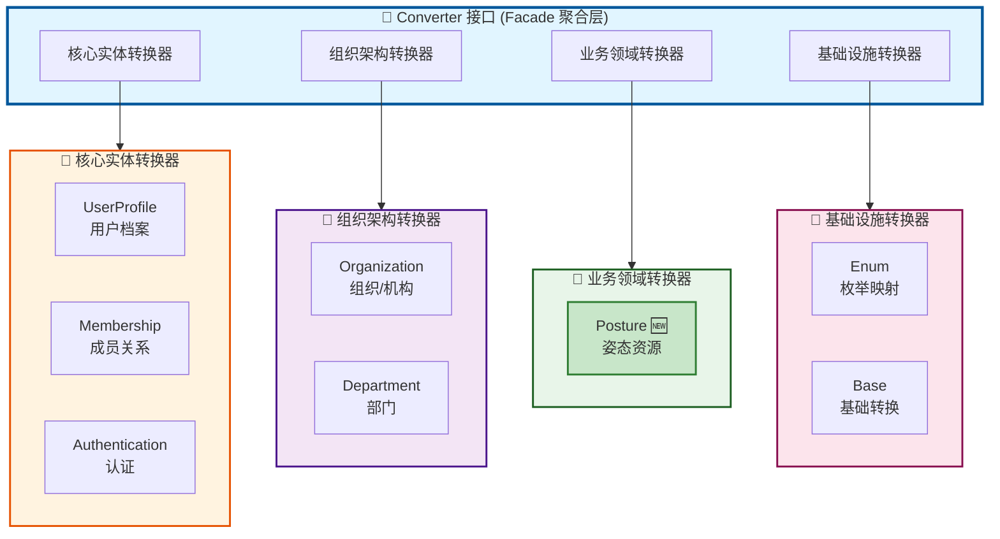
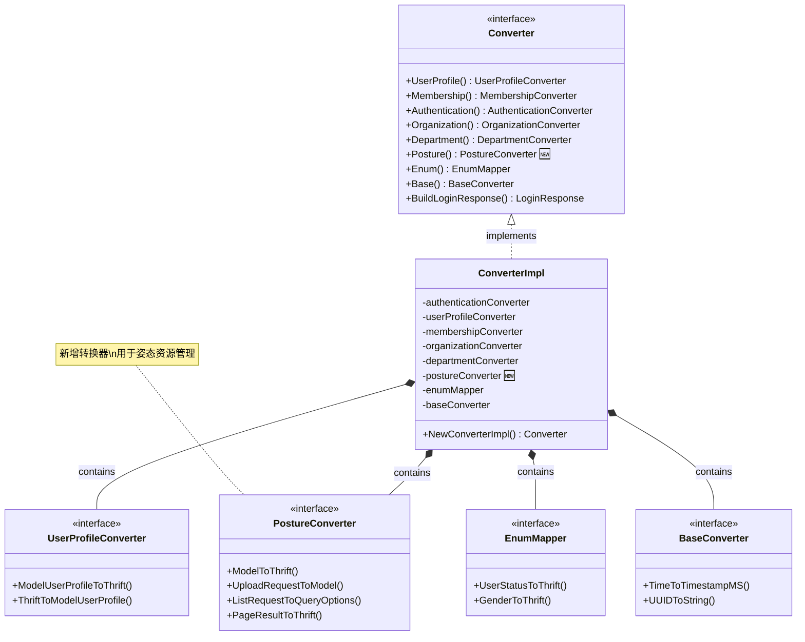
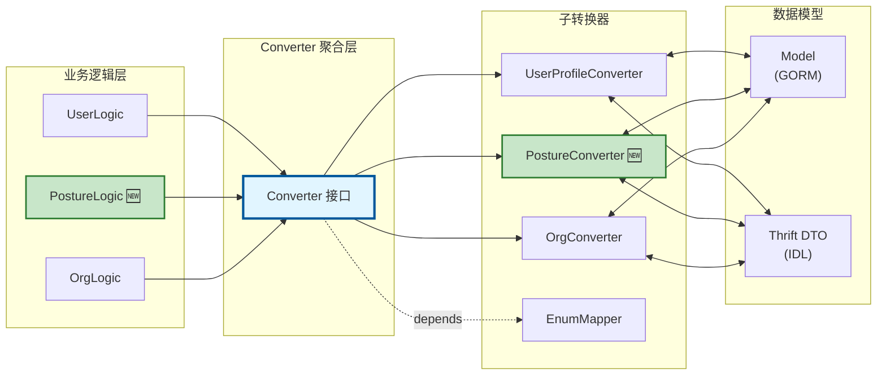
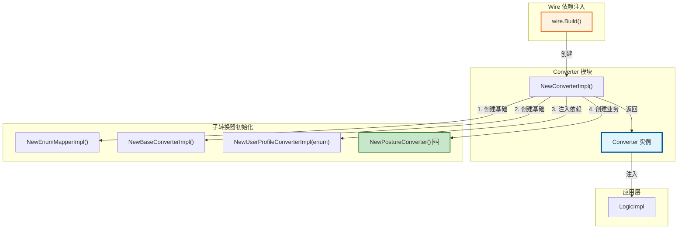

# Converter 层架构设计

## 概述

Converter 层负责 Model 与 Thrift DTO 之间的双向转换，采用**聚合模式（Facade Pattern）**设计，为业务逻辑层提供统一的转换服务入口。

## 架构图

### 整体架构视图



### 接口与实现关系



### 使用流程图



### 依赖关系图



## 设计理念

### 1. 统一入口

业务逻辑层只需依赖一个 `Converter` 接口，简化依赖管理：

```go
type UserLogicImpl struct {
    dal  dal.DAL
    conv converter.Converter  // ← 单一依赖
}

func NewUserLogic(dal dal.DAL, conv converter.Converter) UserLogic {
    return &UserLogicImpl{dal: dal, conv: conv}
}

// 使用示例
userThrift := logic.conv.UserProfile().ModelUserProfileToThrift(user)
```

**优势**：
- Wire 依赖注入简化（1 个依赖 vs 7+ 个依赖）
- 避免循环依赖
- 统一的初始化流程

### 2. 职责分离

每个子转换器专注于单一实体的转换逻辑，符合**单一职责原则（SRP）**：

```
biz/converter/
├── converter.go              # 聚合接口定义
├── converter_impl.go         # 聚合接口实现
├── factories.go              # 独立工厂函数
├── user/                     # 用户转换器
│   ├── user_converter.go
│   └── user_converter_impl.go
├── posture/                  # 姿态资源转换器
│   ├── posture_converter.go
│   └── posture_converter_impl.go
└── ...
```

### 3. 复合操作支持

提供跨实体的复合转换方法，避免业务层直接操作多个转换器：

```go
// 复合转换：用户档案 + 成员关系 → 登录响应
func (c *ConverterImpl) BuildLoginResponse(
    userProfile *models.UserProfile,
    memberships []*models.UserMembership,
) *identity_srv.LoginResponse {
    resp := &identity_srv.LoginResponse{}
    resp.UserProfile = c.userProfileConverter.ModelUserProfileToThrift(userProfile)
    resp.Memberships = c.authenticationConverter.ModelUserMembershipsToThrift(memberships)
    return resp
}
```

### 4. 扩展友好

新增实体转换器只需 3 步：

```go
// 步骤 1: 创建子转换器包
package posture
type PostureConverter interface { ... }

// 步骤 2: 在聚合接口中添加访问方法
type Converter interface {
    Posture() posture.PostureConverter  // ← 新增
}

// 步骤 3: 在实现中初始化
type ConverterImpl struct {
    postureConverter posture.PostureConverter  // ← 新增
}
```

## 分组说明

### 核心实体转换器 - 用户身份与权限

| 转换器 | 职责 | 主要方法 |
|--------|------|----------|
| `UserProfile` | 用户档案转换 | `ModelUserProfileToThrift` |
| `Membership` | 成员关系转换 | `ModelMembershipToThrift` |
| `Authentication` | 认证场景转换 | `ModelUserMembershipsToThrift` |

### 组织架构转换器 - 组织管理

| 转换器 | 职责 | 主要方法 |
|--------|------|----------|
| `Organization` | 组织转换 | `ModelOrganizationToThrift` |
| `Department` | 部门转换 | `ModelDepartmentToThrift` |

### 业务领域转换器 - 专业功能模块

| 转换器 | 职责 | 主要方法 |
|--------|------|----------|
| `Posture` | 姿态资源转换 | `ModelToThrift`, `UploadRequestToModel` |

### 基础设施转换器 - 通用工具

| 转换器 | 职责 | 主要方法 |
|--------|------|----------|
| `Enum` | 枚举类型映射 | `UserStatusToThrift`, `GenderToThrift` |
| `Base` | 基础类型转换 | `TimeToTimestampMS`, `UUIDToString` |

## 使用指南

### 标准用法（推荐）

在业务逻辑层中使用：

```go
type PostureLogicImpl struct {
    repo posture.PostureResourceRepository
    conv converter.Converter  // ← 使用聚合接口
}

func (l *PostureLogicImpl) GetPostureResource(ctx context.Context, req *identity_srv.GetPostureResourceRequest) (*identity_srv.PostureResource, error) {
    // 查询数据库
    resource, err := l.repo.GetByID(ctx, *req.ResourceID)
    if err != nil {
        return nil, err
    }

    // 使用转换器
    return l.conv.Posture().ModelToThrift(resource), nil
}
```

### 独立使用（特殊场景）

适用于工具脚本、测试、一次性函数：

```go
// 方式 1: 使用工厂函数
func MigratePostureData() {
    conv := converter.NewStandalonePostureConverter()
    for _, model := range models {
        thrift := conv.ModelToThrift(model)
        // 处理转换后的数据
    }
}

// 方式 2: 使用快速转换函数
func QuickProcess(model *models.PostureResource) {
    thrift := converter.QuickConvertPostureToThrift(model)
    // ...
}
```

**注意**：
- 独立工厂函数每次调用都创建新实例，不适合高频调用
- 如果已有 `Converter` 实例，应优先使用 `conv.XXX()` 而非工厂函数

## 性能特性

| 特性 | 说明 |
|------|------|
| **初始化成本** | 极低（< 1KB 内存）|
| **并发安全** | 是（无状态设计）|
| **锁竞争** | 无（纯函数）|
| **适用场景** | 高并发 RPC 服务 |

## 最佳实践

### ✅ 推荐做法

```go
// 1. 在 NewLogicImpl 中统一初始化 Converter
func NewLogicImpl(dal dal.DAL, cfg *config.Config) Logic {
    conv := converter.NewConverterImpl()  // ← 一次创建

    return &LogicImpl{
        Logic: user.NewLogic(dal, conv),
        PostureLogic: posture.NewPostureLogic(dal, conv),
        // ... 所有模块共享同一个 conv
    }
}

// 2. 使用 Wire 自动注入
var LogicSet = wire.NewSet(
    converter.NewConverterImpl,  // ← 自动创建并注入
    logic.NewLogicImpl,
)
```

### ❌ 避免做法

```go
// 1. 避免在循环中创建转换器
for _, model := range models {
    conv := converter.NewConverterImpl()  // ❌ 每次循环都创建
    thrift := conv.Posture().ModelToThrift(model)
}

// 2. 避免不必要的独立实例
type PostureLogic struct {
    conv posture.PostureConverter  // ❌ 应使用 converter.Converter
}

// 3. 避免缓存独立实例
var globalPostureConverter = converter.NewStandalonePostureConverter()  // ❌
```

## 扩展示例

### 添加新的转换器

假设要添加 `DicomConverter` 用于 DICOM 数据转换：

```go
// 1. 创建 biz/converter/dicom/dicom_converter.go
package dicom

type DicomConverter interface {
    ModelToThrift(*models.DicomStudy) *identity_srv.DicomStudy
}

func NewDicomConverter() DicomConverter {
    return &dicomConverterImpl{}
}

// 2. 更新 converter.go
type Converter interface {
    // ... 现有方法

    // Dicom DICOM 数据转换器
    Dicom() dicom.DicomConverter  // ← 新增
}

// 3. 更新 converter_impl.go
type ConverterImpl struct {
    // ... 现有字段
    dicomConverter dicom.DicomConverter  // ← 新增
}

func NewConverterImpl() Converter {
    return &ConverterImpl{
        // ... 现有初始化
        dicomConverter: dicom.NewDicomConverter(),  // ← 新增
    }
}

func (c *ConverterImpl) Dicom() dicom.DicomConverter {
    return c.dicomConverter
}

// 4. (可选) 在 factories.go 中添加工厂函数
func NewStandaloneDicomConverter() dicom.DicomConverter {
    return dicom.NewDicomConverter()
}
```

## 常见问题

### Q: 为什么不将每个转换器独立注入到 Logic？

A: 虽然这样更符合接口隔离原则，但会导致：
- Wire 依赖注入配置复杂（需要注入 10+ 个依赖）
- 业务逻辑代码冗长（每个 Logic 需要持有多个转换器）
- 依赖关系难以管理（容易产生循环依赖）

在当前项目规模下（< 15 个实体），聚合模式的收益 > 成本。

### Q: 什么时候使用独立工厂函数？

A: 适用场景：
- ✅ 一次性数据迁移脚本
- ✅ 单元测试（隔离测试某个转换器）
- ✅ 工具函数（不依赖业务逻辑层）

不适用场景：
- ❌ 业务逻辑层（应使用 `Converter` 聚合接口）
- ❌ 高频调用场景（创建实例有开销）

### Q: 如何测试 Converter？

```go
// 方式 1: 测试子转换器（推荐）
func TestPostureConverter(t *testing.T) {
    conv := posture.NewPostureConverter()
    result := conv.ModelToThrift(mockModel)
    assert.Equal(t, expected, result)
}

// 方式 2: 测试聚合接口
func TestConverterIntegration(t *testing.T) {
    conv := converter.NewConverterImpl()
    result := conv.Posture().ModelToThrift(mockModel)
    assert.Equal(t, expected, result)
}

// 方式 3: Mock Converter（在 Logic 测试中）
type MockConverter struct {
    mock.Mock
}
func (m *MockConverter) Posture() posture.PostureConverter {
    return m.Called().Get(0).(posture.PostureConverter)
}
```

## 总结

| 维度 | 评分 | 说明 |
|------|------|------|
| **代码简洁性** | ⭐⭐⭐⭐⭐ | 业务层依赖极简 |
| **可维护性** | ⭐⭐⭐⭐ | 分组清晰，易于定位 |
| **性能** | ⭐⭐⭐⭐⭐ | 无状态设计，并发友好 |
| **可测试性** | ⭐⭐⭐⭐⭐ | Mock 方便 |
| **扩展性** | ⭐⭐⭐⭐ | 遵循开闭原则 |

**综合评价**: ⭐⭐⭐⭐.5 (4.5/5)

对于当前 identity_srv 项目规模，聚合模式设计是合理且高效的选择。
